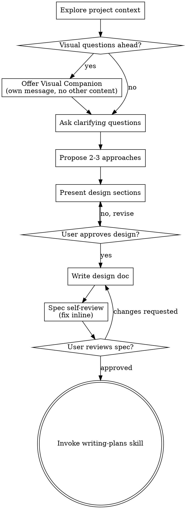

# アイデアをデザインへ昇華させる

自然な対話を通じてアイデアを完全に形成されたデザインと仕様に変換します。

まずプロジェクトの現状を把握し、一度に一つずつ質問してアイデアを洗練させます。何を作るかを理解したら、デザインを提示してユーザーの承認を得ます。

<HARD-GATE>
デザインを提示してユーザーが承認するまで、実装スキルを呼び出したり、コードを書いたり、プロジェクトのスキャフォールドを行ったり、実装アクションを取ったりしてはなりません。これはすべてのプロジェクトに適用されます。
</HARD-GATE>

## アンチパターン：「これはシンプルすぎてデザインは不要」

あらゆるプロジェクトはこのプロセスを経ます。Todoリスト、単機能ユーティリティ、設定変更 — すべてが対象です。「シンプル」なプロジェクトこそ、未検討の思い込みが最も多くの無駄な作業を生みます。デザインは短くて構いません（本当にシンプルなプロジェクトなら数文）が、必ず提示して承認を得てください。

## チェックリスト

以下の各項目についてタスクを作成し、この順番で完了してください：

1. **プロジェクトコンテキストを探索** — ファイル・ドキュメント・最近のコミットを確認
2. **Visual Companion を提案**（ビジュアルな質問が必要なトピックの場合）— 独立したメッセージで行い、確認質問と組み合わせない。下記の Visual Companion セクションを参照
3. **確認質問をする** — 一度に一つ、目的・制約・成功基準を理解する
4. **2〜3のアプローチを提案** — トレードオフと推奨案を示す
5. **デザインを提示** — セクションの複雑さに合わせてスケールし、各セクション後にユーザーの承認を得る
6. **デザインドキュメントを書く** — `.claude/specs/YYYY-MM-DD-<topic>-design.md` に保存してコミット
7. **仕様の自己レビュー** — プレースホルダー・矛盾・曖昧さ・スコープの確認（下記参照）
8. **ユーザーが仕様を確認** — 進める前に仕様ファイルをユーザーにレビューするよう依頼
9. **実装への移行** — writing-plans スキルを呼び出して実装計画を作成

## プロセスフロー

**最終状態は writing-plans の呼び出しです。** frontend-design、mcp-builder、その他の実装スキルを呼び出さないでください。brainstorming の後に呼び出すスキルは writing-plans のみです。

## プロセス詳細

**アイデアを理解する：**

- まずプロジェクトの現状を確認する（ファイル、ドキュメント、最近のコミット）
- 詳細な質問をする前にスコープを評価する：複数の独立したサブシステムが含まれるリクエスト（例：「チャット・ファイルストレージ・決済・分析を持つプラットフォームを作って」）は直ちに指摘する。分解が必要なプロジェクトの詳細を詰めるために質問を費やさないこと。
- プロジェクトが1つの仕様に収まらない場合、サブプロジェクトへの分解を支援する：独立したパーツは何か、どう関連するか、どの順で作るか。そして最初のサブプロジェクトを通常のデザインフローでブレインストーミングする。各サブプロジェクトは独自の仕様 → 計画 → 実装サイクルを持つ。
- 適切なスコープのプロジェクトでは、一度に一つの質問でアイデアを洗練させる
- 可能な限り選択式の質問を使う（オープンエンドも許容）
- メッセージごとに一つの質問のみ — トピックにさらなる探索が必要な場合は複数の質問に分割
- 目的・制約・成功基準の理解に集中する

**アプローチを探る：**

- トレードオフを持つ 2〜3 の異なるアプローチを提案する
- 推奨オプションとその理由を対話形式で提示する
- 推奨オプションを最初に提示し、理由を説明する

**デザインを提示する：**

- 何を作るかを理解したと判断したら、デザインを提示する
- 各セクションをその複雑さに合わせてスケールする：単純なら数文、細かい考慮が必要なら200〜300語まで
- 各セクションの後に「ここまで良さそうですか？」と確認する
- カバーすべき項目：アーキテクチャ、コンポーネント、データフロー、エラーハンドリング、テスト
- 何か理解できない場合は戻って確認することを厭わない

**分離と明確さのためのデザイン：**

- 各ユニットが1つの明確な目的を持ち、明確なインターフェースを通じて通信し、独立して理解・テストできるようにシステムを小さなユニットに分割する
- 各ユニットについて「何をするか、どう使うか、何に依存するか」が答えられるべき
- 内部を読まなくてもユニットが何をするかわかるか？消費者を壊さずに内部を変更できるか？そうでなければ境界を見直す必要がある
- 小さく明確に境界付けられたユニットは扱いやすい — コンテキストに収まるコードの方が推論しやすく、ファイルが集中していれば編集がより信頼できる。ファイルが大きくなったら、それはやりすぎのサインであることが多い

**既存コードベースでの作業：**

- 変更を提案する前に現在の構造を探索する。既存パターンに従う。
- 作業に影響する既存コードの問題（ファイルが大きくなりすぎた、境界が不明確、責務が絡み合っている等）については、デザインの一部として的を絞った改善を含める — 良い開発者が触るコードを改善するように。
- 無関係なリファクタリングを提案しない。現在のゴールに集中する。

## デザイン後の作業

**ドキュメント：**

- 確認済みデザイン（仕様）を `.claude/specs/YYYY-MM-DD-<topic>-design.md` に書き込む
  - （ユーザーの仕様ファイル配置の設定があればそちらが優先）
- 利用可能であれば elements-of-style:writing-clearly-and-concisely スキルを使用
- デザインドキュメントを git にコミットする

**仕様の自己レビュー：**
仕様ドキュメントを書いた後、新鮮な目で確認する：

1. **プレースホルダースキャン：** "TBD"、"TODO"、未完成のセクション、曖昧な要件はないか？修正する。
2. **内部整合性：** セクション間に矛盾はないか？アーキテクチャは機能説明と一致しているか？
3. **スコープ確認：** 1つの実装計画として集中しているか、分解が必要か？
4. **曖昧さの確認：** 2通りに解釈できる要件はないか？あれば1つを選んで明確にする。

問題はインラインで修正する。再レビューは不要 — 修正して次に進む。

**ユーザーレビューゲート：**
仕様レビューループが通過したら、進める前にユーザーに書かれた仕様を確認するよう依頼する：

> 「仕様を `<path>` に書いてコミットしました。実装計画の作成を始める前に確認して、変更があればお知らせください。」

ユーザーの回答を待つ。変更をリクエストされた場合は修正して仕様レビューループを再実行する。ユーザーが承認したら進める。

**実装：**

- writing-plans スキルを呼び出して詳細な実装計画を作成する
- 他のスキルは呼び出さない。writing-plans が次のステップ。

## 重要な原則

- **一度に一つの質問** — 複数の質問で圧倒しない
- **選択式を優先** — 可能な場合はオープンエンドより答えやすい
- **YAGNI を徹底する** — 不要な機能をすべてのデザインから排除
- **代替案を探る** — 落ち着く前に必ず 2〜3 のアプローチを提案
- **段階的な検証** — デザインを提示し、次に進む前に承認を得る
- **柔軟に対応** — 何か理解できない場合は戻って確認する

## Visual Companion

ブレインストーミング中にモックアップ、図、ビジュアルオプションを表示するためのブラウザベースのコンパニオン機能。ツールとして利用可能 — モードではない。コンパニオンを受け入れることは、ビジュアルによる説明が有益な質問に使えるということを意味する。すべての質問がブラウザを通じる必要はない。

**コンパニオンの提案：** ビジュアルコンテンツ（モックアップ、レイアウト、図）が必要な質問が控えている場合、同意を得るために一度提案する：
> 「作業の一部は、ウェブブラウザで表示した方が説明しやすいかもしれません。進行中にモックアップ、図、比較などのビジュアルを表示できます。この機能はまだ新しく、トークンを多く使います。試してみますか？（ローカルURLを開く必要があります）」

**この提案は独立したメッセージでなければなりません。** 確認質問、コンテキストのまとめ、その他のコンテンツと組み合わせないでください。このメッセージにはこの提案のみを含めること。ユーザーの回答を待ってから続行する。断られた場合はテキストのみのブレインストーミングを進める。

**質問ごとの判断：** ユーザーが承認した後も、各質問でブラウザかターミナルかを判断する。判断基準：**ユーザーはそれを読むより見た方が理解しやすいか？**

- **ブラウザを使う：** ビジュアルなコンテンツ — モックアップ、ワイヤーフレーム、レイアウト比較、アーキテクチャ図、サイドバイサイドのビジュアルデザイン
- **ターミナルを使う：** テキストなコンテンツ — 要件質問、概念的な選択、トレードオフリスト、A/B/C/Dテキストオプション、スコープ決定

UIトピックに関する質問が自動的にビジュアル質問になるわけではない。「このコンテキストでパーソナリティは何を意味しますか？」は概念的な質問 — ターミナルを使う。「どちらのウィザードレイアウトが良いですか？」はビジュアル質問 — ブラウザを使う。

コンパニオンに同意された場合は、続行前に詳細ガイドを読む：
`skills/brainstorming/visual-companion.md`
