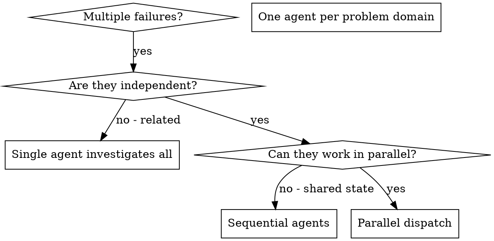

# 並列エージェントの起動

## 概要

独立した文脈を持つ専門エージェントにタスクを委任します。指示と文脈を的確に構成することで、エージェントが集中して成功できるようにします。エージェントはあなたのセッションの文脈や履歴を引き継ぐべきではありません — 必要なものだけを正確に構成してください。これにより自分自身の文脈も調整作業のために保たれます。

複数の無関係な失敗（異なるテストファイル、異なるサブシステム、異なるバグ）がある場合、順次調査するのは時間の無駄です。各調査は独立しており、並列実行できます。

**核心原則:** 独立した問題ドメインごとにエージェントを1つ起動し、並行して作業させる。

## 使うタイミング



**使う場合:**
- 3つ以上のテストファイルが異なる根本原因で失敗している
- 複数のサブシステムが独立して壊れている
- 各問題が他の問題の文脈なしに理解できる
- 調査間で共有状態がない

**使わない場合:**
- 失敗が関連している（1つを修正すると他も修正される可能性）
- システム全体の状態を把握する必要がある
- エージェントが互いに干渉する

## パターン

### 1. 独立したドメインを特定する

失敗を壊れているものでグループ化：
- ファイル A のテスト: ツール承認フロー
- ファイル B のテスト: バッチ完了の動作
- ファイル C のテスト: 中断機能

各ドメインは独立しています — ツール承認を修正しても中断テストには影響しません。

### 2. 集中したエージェントタスクを作成する

各エージェントには以下を渡します：
- **明確なスコープ:** 1つのテストファイルまたはサブシステム
- **明確なゴール:** これらのテストをパスさせる
- **制約:** 他のコードを変更しない
- **期待される出力:** 発見したことと修正したことのサマリー

### 3. 並列で起動する

```typescript
// Claude Code / AI 環境
Task("Fix agent-tool-abort.test.ts failures")
Task("Fix batch-completion-behavior.test.ts failures")
Task("Fix tool-approval-race-conditions.test.ts failures")
// 3つが同時実行される
```

### 4. レビューと統合

エージェントが返ってきたら：
- 各サマリーを読む
- 修正が衝突しないことを確認
- 全テストスイートを実行
- 全変更を統合

## エージェントプロンプトの構造

良いエージェントプロンプトは：
1. **集中している** — 1つの明確な問題ドメイン
2. **自己完結している** — 問題を理解するために必要な全文脈
3. **出力が具体的** — エージェントは何を返すべきか？

```markdown
src/agents/agent-tool-abort.test.ts の3つの失敗テストを修正してください：

1. "should abort tool with partial output capture" - メッセージに 'interrupted at' が期待される
2. "should handle mixed completed and aborted tools" - 高速ツールが完了ではなく中断される
3. "should properly track pendingToolCount" - 3件の結果が期待されるが0件になる

これらはタイミング/競合状態の問題です。タスク：

1. テストファイルを読み、各テストが何を検証するかを理解する
2. 根本原因を特定 — タイミング問題か実際のバグか？
3. 以下の方法で修正:
   - 任意のタイムアウトをイベントベースの待機に置き換える
   - 見つかった場合は中断実装のバグを修正する
   - テストの期待値を変更された動作に合わせて調整

単にタイムアウトを増やさないでください — 本当の問題を見つけてください。

返却: 発見したことと修正したことのサマリー。
```

## よくあるミス

**❌ 広すぎる:** 「全テストを修正して」— エージェントが迷子になる
**✅ 具体的:** 「agent-tool-abort.test.ts を修正して」— 集中したスコープ

**❌ 文脈なし:** 「競合状態を修正して」— エージェントがどこか分からない
**✅ 文脈あり:** エラーメッセージとテスト名を貼り付ける

**❌ 制約なし:** エージェントが全てをリファクタリングするかも
**✅ 制約あり:** 「本番コードを変更しないでください」

**❌ 曖昧な出力:** 「修正して」— 何が変わったか分からない
**✅ 具体的:** 「根本原因と変更点のサマリーを返してください」

## 使わない場合

**関連した失敗:** 1つの修正が他を修正するかも — まず一緒に調査
**全文脈が必要:** 理解にはシステム全体を見る必要がある
**探索的デバッグ:** まだ何が壊れているか分かっていない
**共有状態:** エージェントが干渉する（同じファイルを編集、同じリソースを使用）

## 検証

エージェントが返ってきたら：
1. **各サマリーをレビュー** — 何が変わったか理解する
2. **衝突を確認** — エージェントが同じコードを編集したか？
3. **全スイートを実行** — 全ての修正が一緒に動くか確認
4. **スポットチェック** — エージェントは系統的なエラーを犯すことがある
