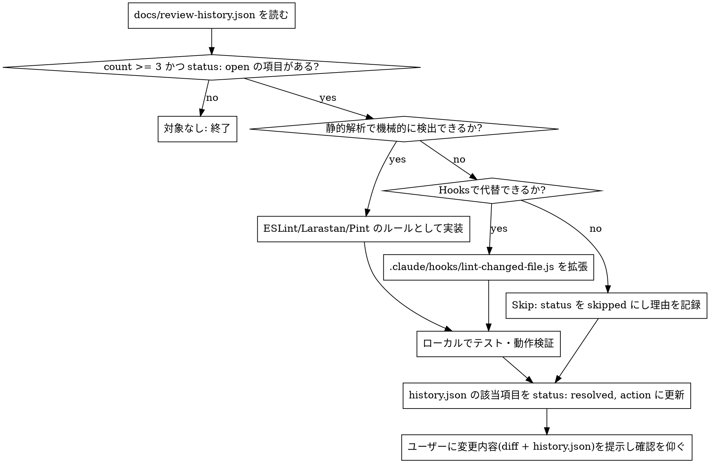

# review-digest

繰り返されるレビュー指摘を検知し、静的解析ルール(または hook)へ自動的に変換するスキル。参考: [食べログ社の事例](https://tech-blog.tabelog.com/entry/react-pipeline-review-digest-claude-code-quality-automation)。

**核心原則：** 同じ指摘を人間・LLMレビュアーに何度も言わせない。3回目で「仕組み化すべき指摘」と判定し、機械的に防ぐ層へ移す。

## 前提：指摘はどこから来るか

`subagent-driven-development` のレビューループ（spec-reviewer / code-quality-reviewer）で、静的解析(ESLint/Pint)では検出できない指摘が出た際、コントローラーが `docs/review-history.json` に記録している（詳細は `subagent-driven-development/SKILL.md` 参照）。このスキルはその蓄積を読み、仕組み化を実行する。

## docs/review-history.json のフォーマット

```json
[
  {
    "category": "命名規約",
    "summary": "イベントハンドラの命名は onXxx ではなく handleXxx に統一する",
    "count": 3,
    "status": "open",
    "action": null,
    "occurrences": [
      { "date": "2026-07-20", "context": "Task 3: WeightController のレビュー", "detail": "onSubmit ではなく handleSubmit にすべきと指摘" }
    ],
    "first_seen": "2026-07-20"
  }
]
```

- `status`: `"open"`（未対応）→ `"resolved"`（仕組み化済み）→（誤検知等で棄却した場合）`"skipped"`
- `count`: 3 未満はまだ「偶然かもしれない」ので静観する。3 以上で仕組み化対象。
- `action`: 実際に行った対応（例: `"eslint-plugin-vue の vue/custom-event-name-casing を有効化"`）。`resolved`/`skipped` になったら埋める。

## 処理フロー



## 自動化手段の判定順位（優先度順）

1. **静的解析（最優先）**: ESLint（フロントエンド）/ Larastan・Pint（バックエンド）のルールとして機械的に検出・拒否できるなら、これを選ぶ。コードに違反があれば必ず引っかかる確実性があり、コンテキストを消費しない。
   - 既存ルールの有効化で足りる場合はそれだけで終わる（例: `eslint-plugin-vue` の既存ルールを `off` → `warn`/`error` に変更）
   - 既存ルールで表現できない場合、カスタムルールの追加を検討する（大掛かりになりすぎる場合は Skip も選択肢）
2. **Hooks（次点）**: 静的解析ツールのルールとして表現しづらい、複雑な条件を伴う指摘（例: 特定ディレクトリでは特定パターンを使う、等）。`.claude/hooks/lint-changed-file.js` に条件分岐を追加する形で拡張する。
3. **Skip（最終手段）**: どちらでも機械的に防げない指摘（設計判断・文脈依存の指摘など）は、`.claude/rules/` への追記で無理に仕組み化しない。コンテキスト肥大化による精度低下の方が害が大きいため。`status: "skipped"` にして理由を `action` に記録し、必要なら人間の議論に委ねる（食べログ社の事例では、Skip 判定した指摘がチーム議論から Knip 導入という別解につながった）。

## 実装後の確認事項

- 追加/変更したルールを実際に対象ファイルへ適用し、意図通り検出されることを確認する（過去に指摘があった箇所、または再現用の一時ファイルで検証）
- 既存コード全体に対して誤検知が大量発生しないか確認する（`npm run lint` / `composer stan` を一度フルで走らせる）。大量に引っかかる場合は `phpstan-baseline.neon` 方式で既存分は退避し、新規コードのみ対象にする
- `docs/review-history.json` を更新し、`status`/`action` を記録する
- 変更内容(diff)と `docs/review-history.json` の該当エントリをユーザーに提示し、コミットするかどうかの判断を仰ぐ（このスキル自身はコミットしない）

## 完璧を求めない

100%自動化を目指して仕組み化そのものが停止するより、一部が `skipped` のまま残っていても、サイクルを回し続ける方が良い結果につながる（食べログ社の事例より）。
