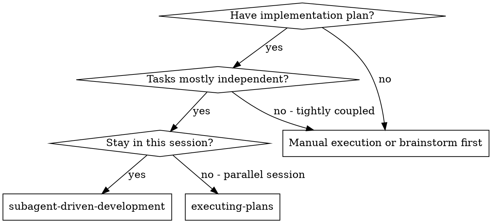
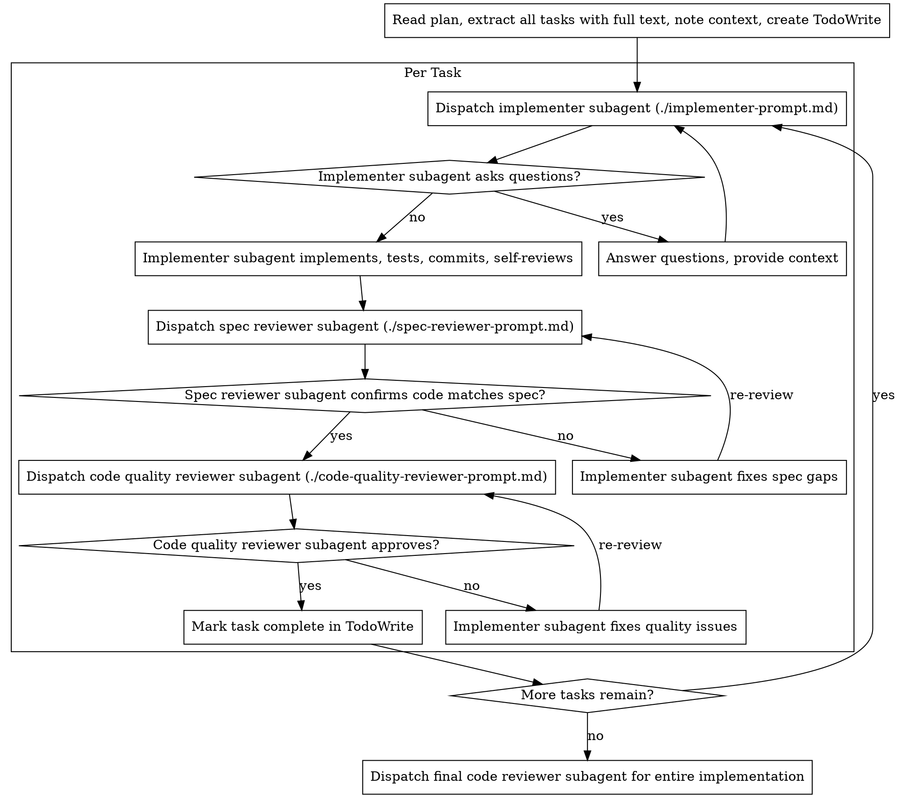

# サブエージェント駆動開発

タスクごとに新しいサブエージェントを起動して計画を実行し、各タスク後に2段階レビュー（仕様適合レビュー → コード品質レビュー）を行います。

**なぜサブエージェントを使うか：** タスクを隔離されたコンテキストを持つ専門エージェントに委任します。指示とコンテキストを正確に構成することで、エージェントが集中して成功できるようにします。自分のセッションのコンテキストや履歴を引き継がせるべきではありません — 必要なものだけを正確に構成してください。これにより自分自身のコンテキストも調整作業のために保たれます。

**核心原則：** タスクごとに新しいサブエージェント + 2段階レビュー（仕様 → 品質）= 高品質、高速イテレーション

**継続実行：** タスク間でユーザーへの確認のために停止しないでください。停止する理由は、BLOCKED ステータスで解決できない場合、genuineに進行を妨げる曖昧さがある場合、またはすべてのタスクが完了した場合のみです。「続行しますか？」のプロンプトや進捗報告は時間の無駄 — 計画を実行するよう依頼されたなら実行してください。

## 使うタイミング



**executing-plans（並列セッション）との比較：**
- 同じセッション（コンテキストスイッチなし）
- タスクごとに新しいサブエージェント（コンテキスト汚染なし）
- 各タスク後に2段階レビュー：仕様適合 → コード品質
- 高速イテレーション（タスク間に人間のレビューなし）

## プロセス



## モデル選択

コストを抑えてスピードを上げるために、各役割を処理できる最も軽量なモデルを使用します。

**機械的な実装タスク**（隔離された関数、明確な仕様、1〜2ファイル）：高速で安価なモデルを使用。計画が十分に具体化されていれば、ほとんどの実装タスクは機械的。

**統合・判断タスク**（複数ファイルの連携、パターンマッチング、デバッグ）：標準モデルを使用。

**アーキテクチャ、デザイン、レビュータスク**：最も高性能なモデルを使用。

**タスクの複雑さのシグナル：**
- 完全な仕様で1〜2ファイルに触れる → 安価なモデル
- 統合上の懸念がある複数ファイルに触れる → 標準モデル
- デザインの判断や広範なコードベース理解が必要 → 最高性能のモデル

## 実装者のステータスへの対応

実装者サブエージェントは4つのステータスのいずれかを報告します。それぞれに適切に対応してください：

**DONE：** 仕様適合レビューに進む。

**DONE_WITH_CONCERNS：** 実装者が作業を完了したが懸念を示した。進む前に懸念を読む。正確性やスコープに関する懸念であればレビュー前に対処する。観察（例：「このファイルが大きくなっています」）であれば記録して進む。

**NEEDS_CONTEXT：** 実装者に提供されていない情報が必要。不足しているコンテキストを提供して再起動する。

**BLOCKED：** 実装者がタスクを完了できない。ブロッカーを評価する：
1. コンテキストの問題であれば、より多くのコンテキストを提供して同じモデルで再起動
2. タスクにより多くの推論が必要であれば、より高性能なモデルで再起動
3. タスクが大きすぎれば、より小さなピースに分割
4. 計画自体が間違っていれば、ユーザーにエスカレーション

**変更なしで同じモデルをリトライしたり、エスカレーションを無視したりしてはなりません。** 実装者が詰まったと言ったなら、何かを変える必要があります。

## プロンプトテンプレート

- `./implementer-prompt.md` — 実装者サブエージェントの起動
- `./spec-reviewer-prompt.md` — 仕様適合レビュアーサブエージェントの起動
- `./code-quality-reviewer-prompt.md` — コード品質レビュアーサブエージェントの起動

## ワークフロー例

```
You: I'm using Subagent-Driven Development to execute this plan.

[Read plan file once: .claude/plans/feature-plan.md]
[Extract all 5 tasks with full text and context]
[Create TodoWrite with all tasks]

Task 1: Hook installation script

[Get Task 1 text and context (already extracted)]
[Dispatch implementation subagent with full task text + context]

Implementer: "Before I begin - should the hook be installed at user or system level?"

You: "User level (~/.config/superpowers/hooks/)"

Implementer: "Got it. Implementing now..."
[Later] Implementer:
  - Implemented install-hook command
  - Added tests, 5/5 passing
  - Self-review: Found I missed --force flag, added it
  - Committed

[Dispatch spec compliance reviewer]
Spec reviewer: ✅ Spec compliant - all requirements met, nothing extra

[Get git SHAs, dispatch code quality reviewer]
Code reviewer: Strengths: Good test coverage, clean. Issues: None. Approved.

[Mark Task 1 complete]

Task 2: Recovery modes

[Get Task 2 text and context (already extracted)]
[Dispatch implementation subagent with full task text + context]

Implementer: [No questions, proceeds]
Implementer:
  - Added verify/repair modes
  - 8/8 tests passing
  - Self-review: All good
  - Committed

[Dispatch spec compliance reviewer]
Spec reviewer: ❌ Issues:
  - Missing: Progress reporting (spec says "report every 100 items")
  - Extra: Added --json flag (not requested)

[Implementer fixes issues]
Implementer: Removed --json flag, added progress reporting

[Spec reviewer reviews again]
Spec reviewer: ✅ Spec compliant now

[Dispatch code quality reviewer]
Code reviewer: Strengths: Solid. Issues (Important): Magic number (100)

[Implementer fixes]
Implementer: Extracted PROGRESS_INTERVAL constant

[Code reviewer reviews again]
Code reviewer: ✅ Approved

[Mark Task 2 complete]

...

[After all tasks]
[Dispatch final code-reviewer]
Final reviewer: All requirements met, ready to merge

Done!
```

## メリット

**手動実行との比較：**
- サブエージェントが自然にTDDに従う
- タスクごとに新しいコンテキスト（混乱なし）
- 並列安全（サブエージェントが干渉しない）
- サブエージェントが質問できる（作業前も作業中も）

**executing-plans との比較：**
- 同じセッション（引き渡しなし）
- 継続的な進捗（待機なし）
- レビューチェックポイントが自動

**効率の向上：**
- ファイル読み込みオーバーヘッドなし（コントローラーが全文を提供）
- コントローラーが必要なコンテキストを正確に精選
- サブエージェントが完全な情報を事前に取得
- 質問が作業開始前に解決される（後ではなく）

**品質ゲート：**
- 自己レビューが引き渡し前の問題を発見
- 2段階レビュー：仕様適合 → コード品質
- レビューループが修正が実際に機能することを確保
- 仕様適合が過剰/不足実装を防ぐ
- コード品質が実装が適切に構築されていることを確保

**コスト：**
- 多くのサブエージェント起動（タスクごとに実装者 + 2レビュアー）
- コントローラーがより多くの準備作業を行う（全タスクを事前に抽出）
- レビューループがイテレーションを追加
- ただし問題を早期に発見（後でデバッグするより安い）

## 危険なサイン

**してはいけないこと：**
- ユーザーの明示的な同意なしにmain/masterブランチで実装を開始する
- レビューをスキップする（仕様適合またはコード品質）
- 未修正の問題で進む
- 複数の実装サブエージェントを並列で起動する（競合が発生する）
- サブエージェントに計画ファイルを読ませる（代わりに全文を提供する）
- 場面設定コンテキストをスキップする（サブエージェントはタスクがどこに収まるかを理解する必要がある）
- サブエージェントの質問を無視する（進める前に回答する）
- 仕様適合で「だいたい良い」を受け入れる（仕様レビュアーが問題を見つけた = 完了していない）
- レビューループをスキップする（レビュアーが問題を見つけた = 実装者が修正 = 再レビュー）
- 実装者の自己レビューで実際のレビューを置き換える（両方が必要）
- **仕様適合が ✅ になる前にコード品質レビューを開始する**（順序が間違い）
- いずれかのレビューに未解決の問題がある状態で次のタスクに移る

**サブエージェントが質問をした場合：**
- 明確かつ完全に回答する
- 必要に応じて追加のコンテキストを提供する
- 急いで実装させない

**レビュアーが問題を見つけた場合：**
- 実装者（同じサブエージェント）が修正する
- レビュアーが再レビューする
- 承認されるまで繰り返す
- 再レビューをスキップしない

**サブエージェントがタスクに失敗した場合：**
- 具体的な指示を持つ修正サブエージェントを起動する
- 手動で修正しようとしない（コンテキスト汚染）

## 連携

**必須ワークフロースキル：**
- **superpowers:using-git-worktrees** — 隔離されたワークスペースを確保（作成または既存を確認）
- **superpowers:writing-plans** — このスキルが実行する計画を作成
- **superpowers:requesting-code-review** — レビュアーサブエージェントのコードレビューテンプレート

**サブエージェントが使うべきスキル：**
- **superpowers:test-driven-development** — サブエージェントが各タスクでTDDに従う

**代替ワークフロー：**
- **superpowers:executing-plans** — 同セッション実行の代わりに並列セッションを使用
