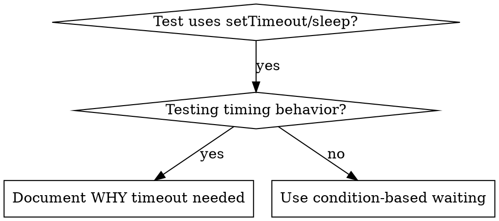

# 条件ベースの待機

## 概要

不安定なテストは、しばしば任意の遅延でタイミングを推測します。これにより、テストが速いマシンではパスするが、負荷がかかったり CI 環境では失敗するという競合状態が発生します。

**核心原則：** どのくらいかかるかの推測ではなく、実際に必要な条件を待つ。

## 使うタイミング



**以下の場合に使用する：**
- テストに任意の遅延がある（`setTimeout`、`sleep`、`time.sleep()`）
- テストが不安定（ときどきパス、負荷がかかると失敗）
- 並列実行するとテストがタイムアウトする
- 非同期操作の完了を待っている

**使用しない場合：**
- 実際のタイミング動作をテストしている（デバウンス、スロットル間隔）
- 任意のタイムアウトを使う場合は必ずなぜかをコメントする

## コアパターン

```typescript
// ❌ BEFORE: Guessing at timing
await new Promise(r => setTimeout(r, 50));
const result = getResult();
expect(result).toBeDefined();

// ✅ AFTER: Waiting for condition
await waitFor(() => getResult() !== undefined);
const result = getResult();
expect(result).toBeDefined();
```

## クイックパターン

| シナリオ | パターン |
|----------|---------|
| イベントを待つ | `waitFor(() => events.find(e => e.type === 'DONE'))` |
| 状態を待つ | `waitFor(() => machine.state === 'ready')` |
| 件数を待つ | `waitFor(() => items.length >= 5)` |
| ファイルを待つ | `waitFor(() => fs.existsSync(path))` |
| 複雑な条件 | `waitFor(() => obj.ready && obj.value > 10)` |

## 実装

汎用ポーリング関数：
```typescript
async function waitFor<T>(
  condition: () => T | undefined | null | false,
  description: string,
  timeoutMs = 5000
): Promise<T> {
  const startTime = Date.now();

  while (true) {
    const result = condition();
    if (result) return result;

    if (Date.now() - startTime > timeoutMs) {
      throw new Error(`Timeout waiting for ${description} after ${timeoutMs}ms`);
    }

    await new Promise(r => setTimeout(r, 10)); // Poll every 10ms
  }
}
```

`waitFor`、`waitForEvent`、`waitForEventCount`、`waitForEventMatch` のようなドメイン固有のヘルパーを含む完全な実装については、このディレクトリの `condition-based-waiting-example.ts` を参照してください。

## よくある間違い

**❌ ポーリングが速すぎる：** `setTimeout(check, 1)` — CPUを無駄遣いする
**✅ 修正：** 10msごとにポーリングする

**❌ タイムアウトなし：** 条件が満たされなければ永遠にループする
**✅ 修正：** 常に明確なエラーを含むタイムアウトを含める

**❌ 古いデータ：** ループの前に状態をキャッシュする
**✅ 修正：** 新鮮なデータのためにループ内でゲッターを呼び出す

## 任意のタイムアウトが正しい場合

```typescript
// Tool ticks every 100ms - need 2 ticks to verify partial output
await waitForEvent(manager, 'TOOL_STARTED'); // First: wait for condition
await new Promise(r => setTimeout(r, 200));   // Then: wait for timed behavior
// 200ms = 2 ticks at 100ms intervals - documented and justified
```

**要件：**
1. まずトリガー条件を待つ
2. 既知のタイミングに基づく（推測ではなく）
3. なぜかを説明するコメント

## 実世界への影響

デバッグセッション（2025-10-03）から：
- 3ファイルで15の不安定なテストを修正
- パス率：60% → 100%
- 実行時間：40%短縮
- 競合状態ゼロ
