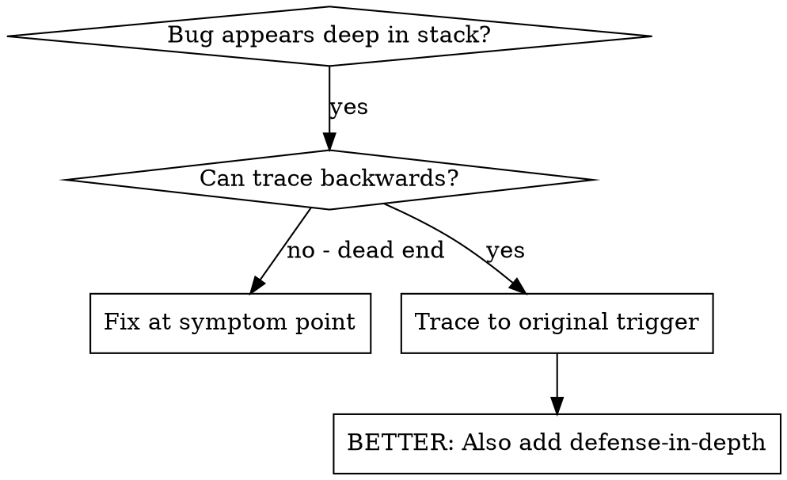
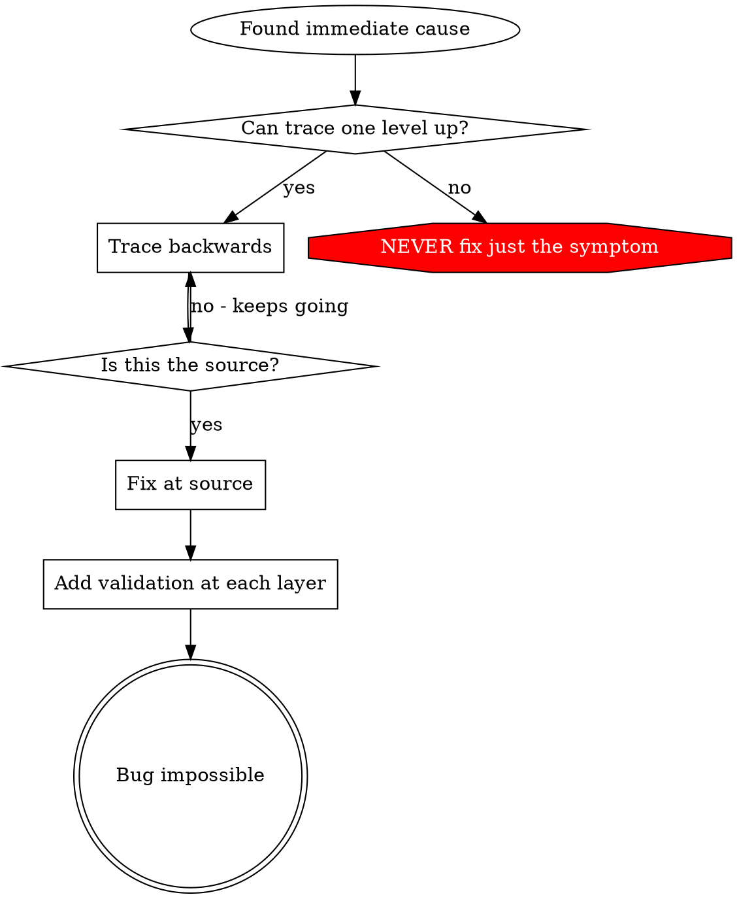

# 根本原因のトレース

## 概要

バグはしばしばコールスタックの奥深く（間違ったディレクトリでの git init、間違った場所に作成されたファイル、間違ったパスで開かれたデータベース）で現れます。エラーが現れた場所を修正しようとするのが本能ですが、それは症状を治療しているに過ぎません。

**核心原則：** 最初のトリガーを見つけるまでコールチェーンを遡ってトレースし、ソースで修正する。

## 使うタイミング



**以下の場合に使用する：**
- エントリポイントではなく実行の奥深くでエラーが発生する
- スタックトレースに長いコールチェーンが示されている
- 無効なデータがどこから発生したかが不明
- どのテスト/コードが問題を引き起こしているかを見つける必要がある

## トレースプロセス

### 1. 症状を観察する
```
Error: git init failed in ~/project/packages/core
```

### 2. 直接の原因を見つける
**このエラーを直接引き起こしているコードは何か？**
```typescript
await execFileAsync('git', ['init'], { cwd: projectDir });
```

### 3. 問いかける：これを呼んだのは何か？
```typescript
WorktreeManager.createSessionWorktree(projectDir, sessionId)
  → called by Session.initializeWorkspace()
  → called by Session.create()
  → called by test at Project.create()
```

### 4. さらに遡る
**渡された値は何か？**
- `projectDir = ''`（空文字列！）
- `cwd` としての空文字列は `process.cwd()` に解決される
- それはソースコードディレクトリ！

### 5. 元のトリガーを見つける
**空文字列はどこから来たか？**
```typescript
const context = setupCoreTest(); // Returns { tempDir: '' }
Project.create('name', context.tempDir); // Accessed before beforeEach!
```

## スタックトレースの追加

手動でトレースできない場合、計装を追加する：

```typescript
// Before the problematic operation
async function gitInit(directory: string) {
  const stack = new Error().stack;
  console.error('DEBUG git init:', {
    directory,
    cwd: process.cwd(),
    nodeEnv: process.env.NODE_ENV,
    stack,
  });

  await execFileAsync('git', ['init'], { cwd: directory });
}
```

**重要：** テストでは `console.error()` を使用する（logger ではなく — 表示されないかもしれない）

**実行してキャプチャ：**
```bash
npm test 2>&1 | grep 'DEBUG git init'
```

**スタックトレースを分析する：**
- テストファイル名を探す
- 呼び出しをトリガーしている行番号を見つける
- パターンを特定する（同じテスト？同じパラメータ？）

## テストを汚染しているのがどのテストかを見つける

テスト中に何かが現れるがどのテストかわからない場合：

このディレクトリの bisection スクリプト `find-polluter.sh` を使う：

```bash
./find-polluter.sh '.git' 'src/**/*.test.ts'
```

テストを一つずつ実行し、最初の汚染者で停止する。使い方はスクリプトを参照。

## 実際の例：空の projectDir

**症状：** `.git` が `packages/core/`（ソースコード）に作成される

**トレースチェーン：**
1. `git init` が `process.cwd()` で実行される ← 空の cwd パラメータ
2. WorktreeManager が空の projectDir で呼ばれる
3. Session.create() が空文字列を渡す
4. テストが `context.tempDir` に beforeEach の前にアクセス
5. setupCoreTest() が最初に `{ tempDir: '' }` を返す

**根本原因：** beforeEach の前に空の値にアクセスするトップレベルの変数初期化

**修正：** tempDir を beforeEach の前にアクセスされると例外を投げる getter にした

**さらに defense-in-depth を追加：**
- レイヤー1：Project.create() がディレクトリを検証
- レイヤー2：WorkspaceManager が空でないことを検証
- レイヤー3：NODE_ENV ガードが tmpdir 外での git init を拒否
- レイヤー4：git init の前にスタックトレースのログを記録

## 重要な原則



**エラーが現れた場所だけを修正してはいけない。** 元のトリガーを見つけるために遡ってトレースする。

## スタックトレースのヒント

**テストでは：** logger ではなく `console.error()` を使う — logger が抑制されている可能性がある
**操作の前に：** 失敗した後ではなく、危険な操作の前にログを記録する
**コンテキストを含める：** ディレクトリ、cwd、環境変数、タイムスタンプ
**スタックをキャプチャ：** `new Error().stack` で完全なコールチェーンが表示される

## 実世界への影響

デバッグセッション（2025-10-03）から：
- 5レベルのトレースを通じて根本原因を発見
- ソースで修正（getter のバリデーション）
- 4レイヤーの防御を追加
- 1847のテストがパス、汚染ゼロ
