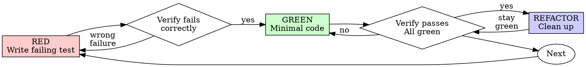

# テスト駆動開発 (TDD)

## 概要

まずテストを書く。失敗することを確認する。それをパスさせる最小限のコードを書く。

**核心原則：** テストが失敗するのを見ていなければ、それが正しいものをテストしているかわからない。

**このルールの文言に違反することは、ルールの精神に違反することと同じです。**

## 使うタイミング

**常に：**
- 新機能
- バグ修正
- リファクタリング
- 動作変更

**例外（ユーザーに確認する）：**
- 捨てるプロトタイプ
- 生成されたコード
- 設定ファイル

「今回だけTDDをスキップしよう」と考えていますか？止まってください。それは合理化です。

## 鉄則

```
失敗するテストなしに本番コードを書いてはならない
```

テストの前にコードを書いたら？削除する。最初からやり直す。

**例外なし：**
- 「参考」として残さない
- テストを書きながら「適用」しない
- それを見ない
- 削除は削除を意味する

テストから新たに実装する。以上。

## Red-Green-Refactor



### RED — 失敗するテストを書く

何が起こるべきかを示す最小限のテストを一つ書く。

<Good>
```typescript
test('retries failed operations 3 times', async () => {
  let attempts = 0;
  const operation = () => {
    attempts++;
    if (attempts < 3) throw new Error('fail');
    return 'success';
  };

  const result = await retryOperation(operation);

  expect(result).toBe('success');
  expect(attempts).toBe(3);
});
```
明確な名前、実際の動作をテスト、一つのこと
</Good>

<Bad>
```typescript
test('retry works', async () => {
  const mock = jest.fn()
    .mockRejectedValueOnce(new Error())
    .mockRejectedValueOnce(new Error())
    .mockResolvedValueOnce('success');
  await retryOperation(mock);
  expect(mock).toHaveBeenCalledTimes(3);
});
```
曖昧な名前、コードではなくモックをテスト
</Bad>

**要件：**
- 一つの動作
- 明確な名前
- 実際のコード（どうしても必要でない限りモックなし）

### RED の確認 — 失敗することを見る

**必須。絶対にスキップしない。**

```bash
npm test path/to/test.test.ts
```

確認すること：
- テストが失敗する（エラーではなく）
- 失敗メッセージが期待通り
- 機能が存在しないことで失敗する（タイプミスではなく）

**テストがパスする？** 既存の動作をテストしている。テストを修正する。

**テストがエラーになる？** エラーを修正して、正しく失敗するまで再実行する。

### GREEN — 最小限のコード

テストをパスさせる最もシンプルなコードを書く。

<Good>
```typescript
async function retryOperation<T>(fn: () => Promise<T>): Promise<T> {
  for (let i = 0; i < 3; i++) {
    try {
      return await fn();
    } catch (e) {
      if (i === 2) throw e;
    }
  }
  throw new Error('unreachable');
}
```
パスさせるのに十分なだけ
</Good>

<Bad>
```typescript
async function retryOperation<T>(
  fn: () => Promise<T>,
  options?: {
    maxRetries?: number;
    backoff?: 'linear' | 'exponential';
    onRetry?: (attempt: number) => void;
  }
): Promise<T> {
  // YAGNI
}
```
過剰設計
</Bad>

機能を追加したり、他のコードをリファクタリングしたり、テストを超えて「改善」したりしない。

### GREEN の確認 — パスすることを見る

**必須。**

```bash
npm test path/to/test.test.ts
```

確認すること：
- テストがパスする
- 他のテストがまだパスしている
- 出力がクリーン（エラー、警告なし）

**テストが失敗する？** テストではなくコードを修正する。

**他のテストが失敗する？** 今すぐ修正する。

### REFACTOR — クリーンアップ

グリーンになった後のみ：
- 重複を削除する
- 名前を改善する
- ヘルパーを抽出する

テストをグリーンに保つ。動作を追加しない。

### 繰り返す

次の機能のために次の失敗するテストへ。

## 良いテスト

| 品質 | 良い例 | 悪い例 |
|---------|------|-----|
| **最小限** | 一つのこと。名前に「and」がある？分割する。 | `test('validates email and domain and whitespace')` |
| **明確** | 名前が動作を説明する | `test('test1')` |
| **意図を示す** | 望ましいAPIを示す | コードが何をすべきかを曖昧にする |

## 順序が重要な理由

**「後でテストを書いて動作を確認しよう」**

コードの後に書かれたテストはすぐにパスします。すぐにパスすることは何も証明しません：
- 間違ったものをテストしているかもしれない
- 動作ではなく実装をテストしているかもしれない
- 忘れたエッジケースを見落とすかもしれない
- バグを捕捉するのを見たことがない

テスト先行はテストが失敗するのを見ることを強制し、実際に何かをテストしていることを証明します。

**「すべてのエッジケースを手動でテスト済み」**

手動テストはアドホックです。すべてをテストしたと思っていても：
- 何をテストしたかの記録がない
- コードが変わったら再実行できない
- プレッシャー下でケースを忘れやすい
- 「試したら動いた」≠ 包括的

自動テストは体系的。毎回同じ方法で実行されます。

**「X時間の作業を削除するのは無駄」**

サンクコストの誤謬。時間はすでに過ぎ去っています。今の選択肢：
- 削除してTDDで書き直す（さらにX時間、高い信頼性）
- そのままにしてテストを後で追加する（30分、低い信頼性、バグの可能性）

「無駄」は信頼できないコードを保持すること。実際のテストなしに動くコードは技術的負債。

**「TDDは教条主義的、実用的であることは適応すること」**

TDDは実用的です：
- コミット前にバグを発見する（後でデバッグするより速い）
- リグレッションを防ぐ（テストが壊れを即座に検出する）
- 動作を文書化する（テストはコードの使い方を示す）
- リファクタリングを可能にする（自由に変更、テストが壊れを検出する）

「実用的」なショートカット = 本番でのデバッグ = より遅い。

**「テスト後も同じ目標を達成する — 精神であって儀式ではない」**

いいえ。テスト後は「これは何をするか？」に答えます。テスト先行は「これは何をすべきか？」に答えます。

テスト後は実装に偏ります。作ったものをテストし、要求されたものをテストしません。覚えているエッジケースを確認し、発見したものをテストしません。

テスト先行は実装前にエッジケースの発見を強制します。テスト後はすべてを覚えているかを確認します（覚えていません）。

30分のテスト後 ≠ TDD。カバレッジは得られますが、テストが機能するという証明を失います。

## よくある合理化

| 言い訳 | 現実 |
|--------|---------|
| 「テストするには単純すぎる」 | 単純なコードも壊れる。テストは30秒かかる。 |
| 「後でテストしよう」 | すぐにパスするテストは何も証明しない。 |
| 「テスト後も同じ目標を達成する」 | テスト後 = 「これは何をするか？」 テスト先行 = 「これは何をすべきか？」 |
| 「手動でテスト済み」 | アドホック ≠ 体系的。記録なし、再実行不可。 |
| 「X時間を削除するのは無駄」 | サンクコストの誤謬。未確認コードを保持することが技術的負債。 |
| 「参考として保持、まずテストを書く」 | それを適用するだろう。それはテスト後。削除は削除を意味する。 |
| 「まず探索が必要」 | 構わない。探索を捨て、TDDで始める。 |
| 「テストが難しい = デザインが不明確」 | テストを聞く。テストしにくい = 使いにくい。 |
| 「TDDは遅くなる」 | TDDはデバッグより速い。実用的 = テスト先行。 |
| 「手動テストが速い」 | 手動はエッジケースを証明しない。変更のたびに再テストが必要。 |
| 「既存コードにテストがない」 | 改善している。既存コードにテストを追加する。 |

## 危険なサイン — 停止して最初からやり直す

- テストの前にコード
- 実装後にテスト
- テストがすぐにパスする
- テストがなぜ失敗したか説明できない
- テストが「後で」追加される
- 「今回だけ」を合理化している
- 「手動でテスト済み」
- 「テスト後も同じ目的を達成する」
- 「精神であって儀式ではない」
- 「参考として保持」または「既存コードを適用」
- 「X時間を費やした、削除は無駄」
- 「TDDは教条主義的、実用的に進めている」
- 「これは違う、なぜなら...」

**これらすべては：コードを削除。TDDで最初からやり直す。を意味します。**

## 例：バグ修正

**バグ：** 空のメールアドレスが受け入れられる

**RED**
```typescript
test('rejects empty email', async () => {
  const result = await submitForm({ email: '' });
  expect(result.error).toBe('Email required');
});
```

**RED の確認**
```bash
$ npm test
FAIL: expected 'Email required', got undefined
```

**GREEN**
```typescript
function submitForm(data: FormData) {
  if (!data.email?.trim()) {
    return { error: 'Email required' };
  }
  // ...
}
```

**GREEN の確認**
```bash
$ npm test
PASS
```

**REFACTOR**
必要に応じて複数フィールドのバリデーションを抽出する。

## 完了前の確認チェックリスト

- [ ] すべての新関数/メソッドにテストがある
- [ ] 実装前に各テストが失敗するのを見た
- [ ] 各テストが期待される理由で失敗した（機能が存在しないため、タイプミスではなく）
- [ ] 各テストをパスさせる最小限のコードを書いた
- [ ] すべてのテストがパスする
- [ ] 出力がクリーン（エラー、警告なし）
- [ ] テストが実際のコードを使用（どうしても必要でない限りモックなし）
- [ ] エッジケースとエラーがカバーされている

すべてのボックスにチェックできない？TDDをスキップした。最初からやり直す。

## 詰まったとき

| 問題 | 解決策 |
|---------|----------|
| テスト方法がわからない | 望ましいAPIを書く。まずアサーションを書く。ユーザーに聞く。 |
| テストが複雑すぎる | デザインが複雑すぎる。インターフェースを単純化する。 |
| すべてをモックしなければならない | コードが密結合すぎる。依存性注入を使う。 |
| テストのセットアップが巨大 | ヘルパーを抽出する。まだ複雑？デザインを単純化する。 |

## デバッグとの統合

バグを発見した？それを再現する失敗するテストを書く。TDDサイクルに従う。テストが修正を証明しリグレッションを防ぐ。

テストなしにバグを修正しない。

## テストのアンチパターン

モックやテストユーティリティを追加するときは、よくある落とし穴を避けるために @testing-anti-patterns.md を読んでください：
- モックの動作ではなく実際の動作をテストする
- 本番クラスにテスト専用メソッドを追加する
- 依存関係を理解せずにモックする

## 最終ルール

```
本番コード → テストが存在して先に失敗した
それ以外 → TDDではない
```

ユーザーの許可なしに例外なし。
